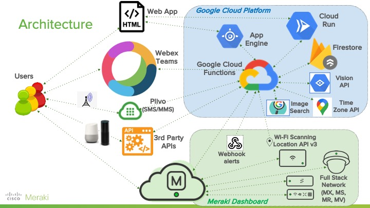
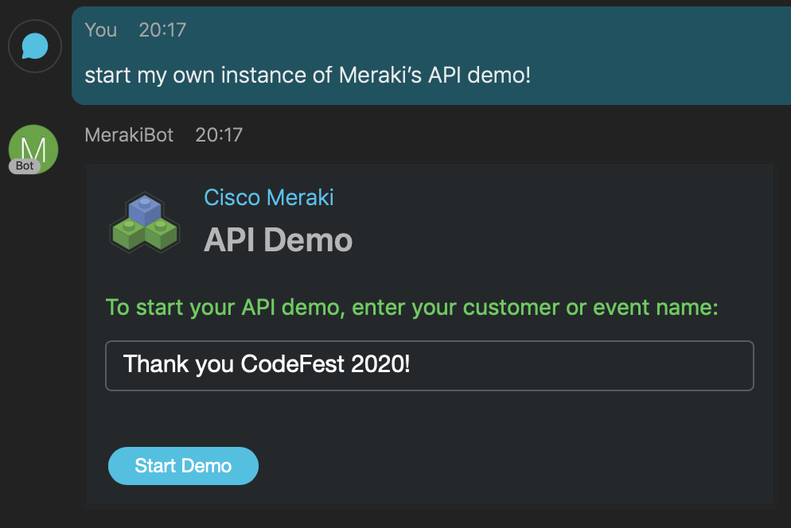
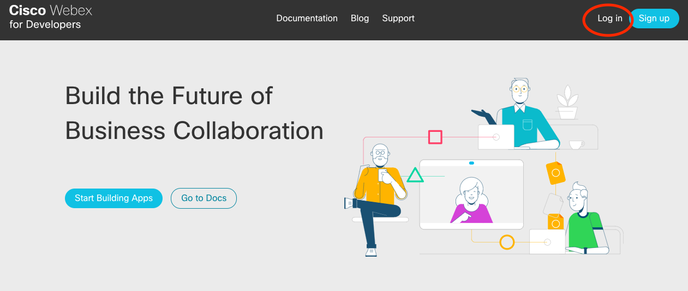
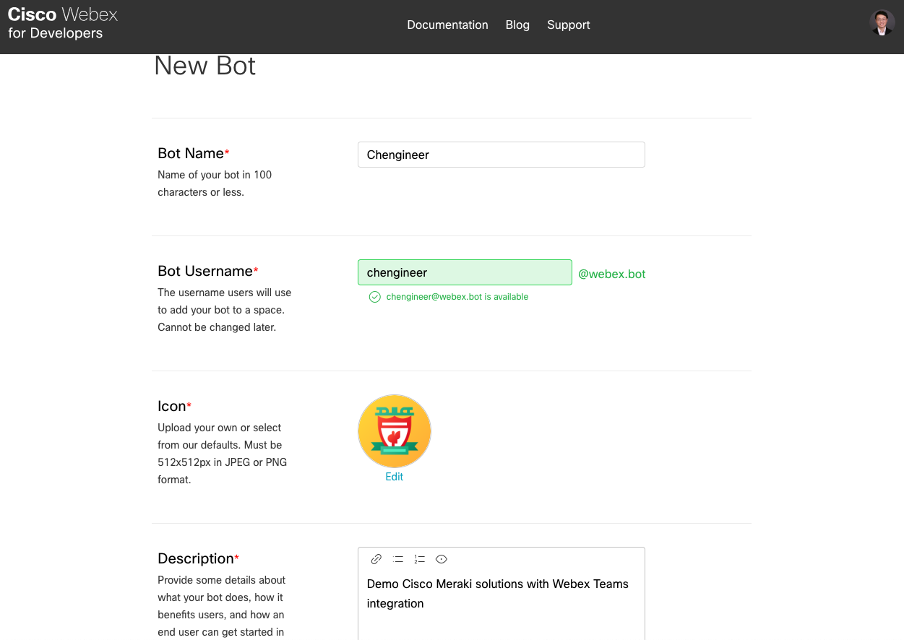
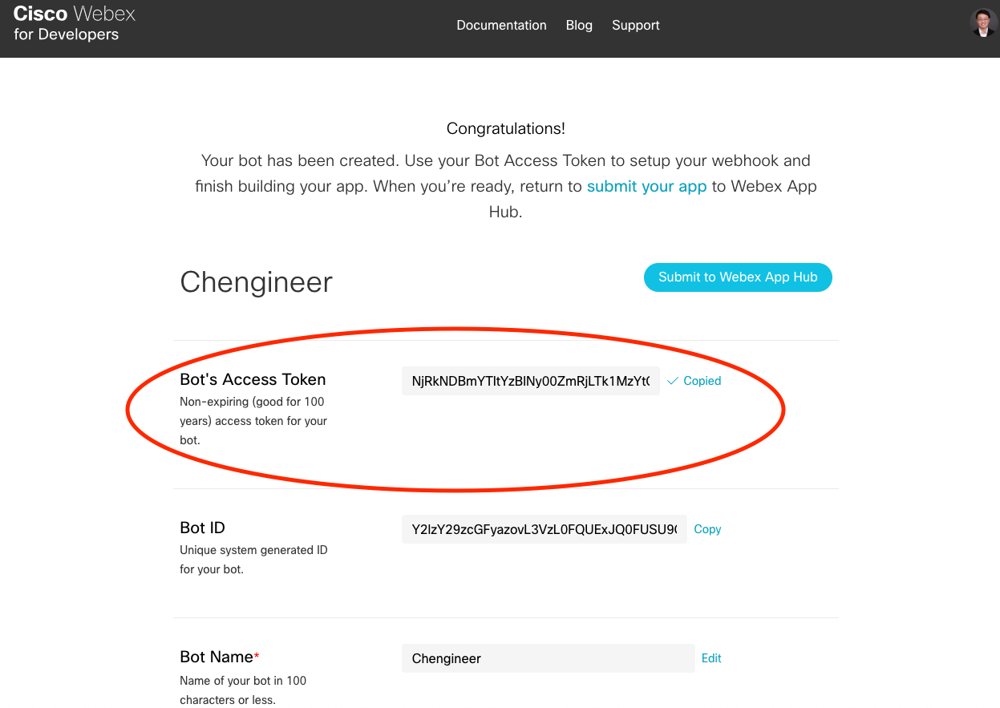
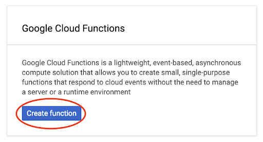
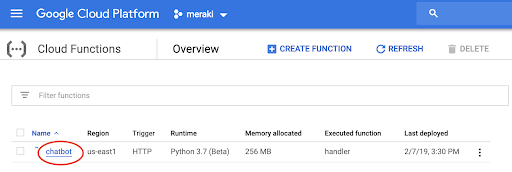
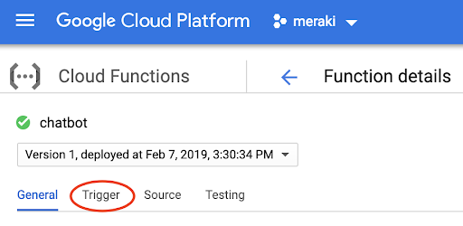
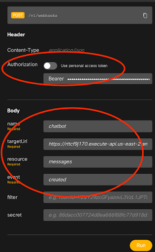

# Meraki API demo platform


---

## How to run this Meraki API demo

In [Webex Teams](https://www.webex.com/downloads.html), chat with **MerakiBot** at _meraki.bot@webex.bot_
> Ask for an “**API demo**” and have some fun!


---

### Part A: Setup Webex Teams chatbot

1. Go to the [Cisco Webex for Developers site](https://developer.webex.com/) and login with your credentials. If you’re new to Webex Teams, you’ll need to create an account first.



2. Click on your avatar upper-right > “My Webex Teams Apps”, then “Create a New App”.

3. Click on “Create a Bot”.

4. Give your bot a name and username (which will be its _@webex.bot_ address), along with description. Optionally, choose an icon, which needs to be exactly 512 x 512 pixels, to use from websites like [Flaticon](https://www.flaticon.com/).



5. Once created, copy the “Bot’s Access Token” and save it for later.




### Part B: Create Cloud Function to react to messages and card submissions

1. Login to the [GCP console dashboard](https://console.cloud.google.com/), and create a new project if needed.

Find “Cloud Functions” from the left-hand menu (pin it for easier access to the top), and then click “Enable API” in the middle of the page.


2. Download and navigate to the [chatbot](chatbot) directory, then within it zip up all the contents.

3. Click “Create function” back in Cloud Functions.



4. Name your function **chatbot**, change “Source code” to **ZIP upload**, “Runtime” to **Python 3.7**, and select **your ZIP file**. Choose a “Stage bucket” (create one with default settings if needed) to store the file, and change “Function to execute” to **handler**. Also, click on “More” and select the “Region” closest to you, then “Create”.


5. Click on the newly-created **chatbot** function.



6. Then the “Trigger” tab.



7. Copy the URL listed at the bottom. You’ll now go back to your chatbot and setup a webhook to POST to this link address, so that when a message or card submission is received by the bot, Webex Teams will send it over for processing in GCP.


### Part C: Connecting Webex Teams with Google Cloud Function

1. Ensure you’re logged in while on the Webex Developers [Create a Webhook](https://developer.webex.com/docs/api/v1/webhooks/create-a-webhook) page on the upper-right.

2. For the “Body” section on the right, enter in **chatbot** for _name_, **messages** for _resource_, **created** for _event_, and copy in the invoke URL from the last step of the previous document for _targetUrl_. See screenshot below for a full example.

3. Also, for the “Header Authorization” section, disable “Use personal access token”, and copy in your bot’s access token.



4. After completing these fields, click “Run” and verify that the response returned (scroll down if needed) is 200 OK.

5. For card submissions, go through the same steps and create a second webhook, except with **attachmentActions** for _resources_.

5. In case multiple webhooks were added by accident, you can check the full list of webhooks associated with your bot by querying with the token [here](https://developer.webex.com/docs/api/v1/webhooks/list-webhooks). You only need/want a single active webhook each for **messages** and **attachmentActions**, because your bot will forward each webhook separately to your cloud for processing, so **if you have multiple webhooks, a single message or card submission may receive multiple replies**. If you run into that issue, [delete](https://developer.webex.com/docs/api/v1/webhooks/delete-a-webhook) your extraneous webhooks.

6. At this point, go to Webex Teams and chat with your bot! You can do that clicking the “+” sign > “Contact a Person” > enter in your bot’s _@webex.bot_ username address.


### Part D: Meraki dashboard webhooks & web app UI

1. Similar to the Cloud Function processing Webex events, the [dashboard](dashboard) directory contains the logic for processing Meraki dashboard webhooks.

Using the GCloud SDK, you can deploy the function by running:
```
gcloud functions deploy dashboard --region=us-east4 --source=[PATH_TO_DASHBOARD_SOURCE]
```

2. The web app offers an alternative UI to the chatbot, and source within [web_ui](web_ui) directory contains the Docker container that is deployed on-demand by Google Cloud Run.

Using the GCloud SDK, you can deploy to Google's Container Registry to be used by Cloud Run by running:
```
gcloud builds submit --tag gcr.io/[PROJECT_ID]/web_ui
```


### Part E: Explanation on environment variables

The following lists all environment variables deployed with the Google Cloud Functions.

For **chatbot** function:
- SERVICE_ACCOUNT_FILE > name of [GCP service account's JSON file](https://cloud.google.com/iam/docs/creating-managing-service-account-keys) included in the function
- BUCKET_ID > name of Firestore object storage bucket
- SCOPES > "https://www.googleapis.com/auth/cloud-platform"
- PROJECT_ID > your GCP project ID
- API_KEY > GCP [API key](https://cloud.google.com/docs/authentication/api-keys) generated for service account
- SEARCH_ID > _cx_ identifier of [custom search engine](https://developers.google.com/custom-search/v1/introduction)
- NAMESPACE > [namespace](https://cloud.google.com/config-connector/docs/concepts/namespaces-and-projects) for Google Cloud Run
- SANDBOX_KEY > Meraki sandbox dashboard API Key
- SANDBOX_ORG > Meraki sandbox dashboard org ID
- RUN_DOMAIN > unique domain generated by Google Cloud Run for your project/region, for example "-abcdefghij-uc.a.run.app/"
- PLIVO_AUTH_ID > authentication ID for [Plivo's SMS API](https://www.plivo.com/sms/)
- PLIVO_AUTH_TOKEN > authentication token for Plivo account
- PLIVO_PHONE_NUMBER > phone number for Plivo account
- MERAKI_DEMO_API_KEY > Meraki dashboard API key for creating new orgs
- BOT_TOKEN > [Webex Teams](https://developer.webex.com/) chatbot token
- BOT_EMAIL > Webex Teams chatbot email

For **dashboard** webhooks function:
- PROJECT_ID > your GCP project ID
- COLLECTION_ID > name of Firestore object storage bucket
- BOT_TOKEN > [Webex Teams](https://developer.webex.com/) chatbot token